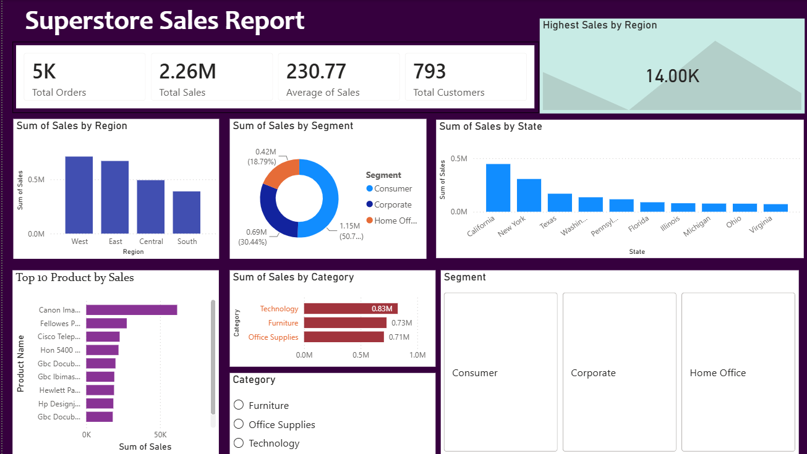

## 📊 Superstore Sales Dashboard

## 📌 Project Overview

The **Superstore Sales Dashboard** is a Data Analytics project that analyzes sales performance using the Superstore dataset. The project focuses on identifying sales trends, top-performing products, customer segments, and regional performance through SQL analysis and an interactive Power BI dashboard.

This dashboard helps transform raw sales data into meaningful business insights to support data-driven decision-making.

---

## 🎯 Objectives

- Analyze overall sales performance.
- Identify top-performing regions and product categories.
- Understand customer purchasing behavior.
- Analyze sales by customer segment and state.
- Build an interactive Power BI dashboard for business reporting.

---

## 📂 Dataset Information

- **Dataset:** Superstore Sales Dataset
- **Source:** Kaggle
- **Total Records:** 9,801
- **File Format:** CSV

### Dataset Columns

- Row ID
- Order ID
- Order Date
- Ship Date
- Ship Mode
- Customer ID
- Customer Name
- Segment
- Country
- City
- State
- Postal Code
- Region
- Product ID
- Category
- Sub-Category
- Product Name
- Sales

---

## 🛠️ Tools & Technologies

- Microsoft Excel
- MySQL
- Power BI

---

## 💻 SQL Analysis

The dataset was analyzed using SQL with the following concepts:

- SELECT
- WHERE
- GROUP BY
- ORDER BY
- LIMIT
- SUM()
- AVG()
- MAX()
- MIN()
- COUNT()

### Analysis Performed

- Total Sales
- Total Orders
- Average Sales
- Top 10 Products by Sales
- Sales by Category
- Sales by Region
- Sales by State
- Sales by Customer Segment
- Top Customers

---

## 📊 Dashboard Features

The Power BI dashboard includes:

### KPI Cards
- Total Orders
- Total Sales
- Average Sales
- Total Customers
- Highest Sales by Region

### Visualizations
- Sales by Region
- Sales by Segment
- Sales by State
- Top 10 Products by Sales
- Sales by Category

### Interactive Filters
- Category
- Segment

---

## 📈 Business Insights

- The **West** region recorded the highest overall sales.
- The **Consumer** segment generated the largest share of sales.
- **Technology** was the best-performing product category.
- A small number of products contributed significantly to total sales.
- Sales performance varied across different states, highlighting regional differences in customer demand.

---

## 📷 Dashboard Preview



---

## 🚀 Conclusion

This project demonstrates practical Data Analytics skills by combining SQL and Power BI to analyze retail sales data. The dashboard provides interactive visualizations that help users understand sales performance and support informed business decisions.

---

## 📁 Repository Structure

```text
Superstore-Sales-Dashboard/
│
├── README.md
├── train.csv
├── queries.sql
├── Superstore_Sales_Dashboard.pbix
├── exceldash.xlsx
└── screenshots/
    └── dashboard.png
```

---

## 👩‍💻 Author

**Ramseena M**

**Aspiring Data Analyst**

### Skills
- Microsoft Excel
- SQL (MySQL)
- Power BI
- Tableau
- MongoDB
